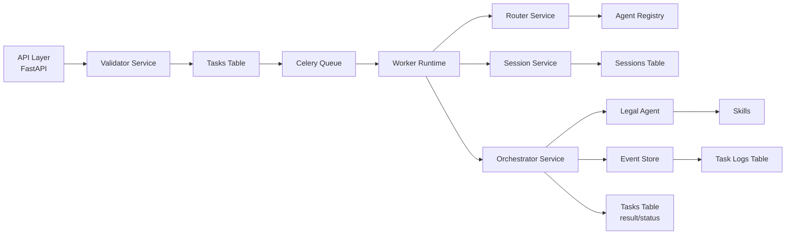

# Kratos Agents Turbo


## 1. Document Status

This repository is the platform-core foundation for a legal agent execution backend.

Current position:

- architecture direction is defined
- core runtime path is implemented
- persistence model is initialized
- service boundaries are explicit
- auditability path is established

This document is written in an engineering RFC style and should be read as the current architecture contract for the repository.

## 2. Problem Statement

The original system shape was a functional bootstrap:

- API
- worker
- queue

That shape is not sufficient for a legal execution platform where traceability, lifecycle management, and safe evolution are first-order requirements.

The platform must support:

- asynchronous legal task execution
- explicit task/session lifecycle
- append-only execution history
- reusable and declarative agents
- low-friction local bootstrap
- future growth toward stronger validation, richer orchestration, and regulated operational controls

## 3. Goals

- Provide a clear backend foundation for a legal agent execution platform.
- Enforce explicit separation between agent definition, runtime, session lifecycle, event persistence, and transport.
- Adopt an event-first execution model compatible with future event-sourcing evolution.
- Make task execution reconstructable from persisted records.
- Keep the current implementation small enough to operate locally without unnecessary infrastructure.

## 4. Non-Goals

This iteration does not implement:

- frontend
- websocket streaming
- full event sourcing
- authentication and authorization
- multi-tenant isolation
- external court integrations
- advanced multi-agent orchestration
- production-grade observability stack
- RAG, jurimetria, or vector infrastructure

## 5. Architectural Decisions

### 5.1 Event-First Execution

Agents do not mutate database state directly as a system of record abstraction.

The execution path is:

1. validate input
2. register task intent
3. enqueue runtime work
4. resolve agent and session
5. emit structured execution events
6. persist terminal outcome

This creates a migration path toward stronger event-sourced behavior without requiring full event sourcing in the current phase.

### 5.2 Layered Backend

The codebase is intentionally split into six layers:

| Layer | Responsibility |
| --- | --- |
| `Agent Layer` | agent identity, prompt, skills, tools, capabilities, declarative config |
| `Runtime Layer` | Celery worker, queue integration, async execution |
| `Session Layer` | session creation, lifecycle, progress, step state |
| `Event Layer` | append-only operational event persistence |
| `Service Layer` | orchestration, routing, validation, coordination |
| `Persistence Layer` | `tasks`, `sessions`, `task_logs` |

### 5.3 Declarative Agent Catalog

Agents are registered through catalog files and a registry, not embedded as transport-level conditionals.

Current catalog location:

- [`src/agent/catalog/agents.yaml`](./src/agent/catalog/agents.yaml)

### 5.4 Explicit State Machines

`task` and `session` status are controlled through explicit transition rules.

Supported statuses:

- `queued`
- `running`
- `completed`
- `failed`
- `cancelled`

## 6. System Model

### 6.1 Primary Components

| Component | Path | Role |
| --- | --- | --- |
| API | `src/api/` | accepts requests, validates input shape, schedules execution |
| Agent Registry | `src/agent/` | resolves declarative agent definitions |
| Core | `src/core/` | settings, exceptions, status, logging |
| Services | `src/services/` | orchestration and coordination |
| Session Manager | `src/session/` | session persistence and transitions |
| Event Store | `src/events/` | append-only event writes |
| Worker | `src/worker/` | background execution |
| MCP-like Server | `src/mcp/` | local HTTP exposure of skills |
| Skills | `src/skills/` | reusable legal processing primitives |

### 6.2 Persistence Model

The operational persistence model is implemented on Supabase/PostgreSQL.

#### `tasks`

Stores:

- request metadata
- resolved agent identity
- task status
- final result
- error details
- execution timestamps

#### `sessions`

Stores:

- execution lifecycle
- progress
- current step
- execution metadata

#### `task_logs`

Stores:

- append-only events
- step progression
- operational messages
- event payloads for reconstruction

Schema file:

- [`infra/sql/schema.sql`](./infra/sql/schema.sql)

## 7. Execution Flow

### 7.1 Request Path

`POST /tasks`:

1. receives PDF payload and execution metadata
2. calls `validator_service`
3. rejects `session_id` because the public API is create-only in the current phase
4. persists task as `queued`
5. appends `TASK_CREATED`
6. serializes payload for Celery
7. schedules background execution

### 7.2 Worker Path

Worker execution:

1. loads task
2. checks cancellation
3. resolves agent through `router_service`
4. creates or loads session
5. marks task/session as `running`
6. appends `TASK_STARTED`
7. executes agent steps
8. appends `TOOL_CALLED` and `STEP_EXECUTED`
9. persists final state as `completed` or `failed`

### 7.3 Agent Path

Current base agent:

- `legal-document-agent`

Current skill chain:

1. `extract_text_from_pdf`
2. `classify_document`
3. `generate_decision`

## 8. Event Contract

Minimum event types currently defined:

- `TASK_CREATED`
- `TASK_STARTED`
- `STEP_EXECUTED`
- `TOOL_CALLED`
- `TASK_COMPLETED`
- `TASK_FAILED`
- `TASK_CANCELLED`

These are intentionally simple but already sufficient for:

- operational traceability
- progress reconstruction
- audit trail expansion

## 9. Invariants

The following invariants are intended to hold:

- a task must not move from a terminal state to another state
- a session must not move from a terminal state to another state
- the API must not contain heavy orchestration logic
- the worker must execute through the service layer, not through ad hoc DB mutations
- execution-relevant state changes must emit structured events
- settings must be resolved centrally from `src/core/settings.py`

## 10. General Design



## 11. Repository Layout

| Path | Purpose |
| --- | --- |
| `src/api/` | transport layer for HTTP requests |
| `src/agent/` | agent definitions, registry, catalog |
| `src/core/` | central configuration and domain primitives |
| `src/events/` | event storage abstraction |
| `src/services/` | orchestrator, router, validator, session service |
| `src/session/` | session lifecycle and persistence control |
| `src/worker/` | Celery runtime |
| `src/mcp/` | MCP-like skill exposure |
| `src/skills/` | domain skills |
| `infra/sql/` | SQL bootstrap artifacts |

## 12. Interfaces

### 12.1 HTTP Endpoints

| Endpoint | Responsibility |
| --- | --- |
| `GET /health` | minimal service liveness metadata |
| `POST /tasks` | submit legal execution task |
| `GET /tasks` | list tasks |
| `GET /tasks/{task_id}` | read task state/result |
| `POST /tasks/{task_id}/cancel` | cancel task |

### 12.2 Runtime Dependencies

- Redis for broker/backend
- Supabase/PostgreSQL for persistence
- Docker Compose for local bootstrap

## 13. Local Development

### 13.1 Prerequisites

- Docker
- Docker Compose
- Supabase project with schema access

### 13.2 Configuration

1. Copy `.env.example` to `.env`
2. Set `SUPABASE_URL`
3. Set `SUPABASE_KEY`
4. Apply [`infra/sql/schema.sql`](./infra/sql/schema.sql)

### 13.3 Boot

```bash
docker compose up --build
```

Exposed services:

- API: `http://localhost:8000`
- MCP-like server: `http://localhost:8001`
- Redis: `localhost:6379`

### 13.4 Validation

Current local validation commands:

```bash
python -m compileall src tests
pytest -q
docker compose config
```

The current repository includes a minimal automated test suite for:

- `POST /tasks` create-only validation
- session ownership safety
- task/session state machine behavior

## 14. Operational Notes

- Payloads are currently serialized through Celery as base64 content.
- PDF is the only supported document input type in the current path.
- Public `POST /tasks` is create-only; session reuse or resume is not exposed yet.
- Logging is structured at a basic level with `task_id` and `session_id` correlation fields.
- The current implementation is production-shaped, not production-complete.

## 15. Known Gaps

- no formal migration tool yet
- no authn/authz
- no object storage for large files
- no distributed tracing
- no public resume/rebind semantics beyond current session metadata
- no specialized multi-agent routing strategies

## 16. Next Technical Steps

- introduce migrations
- move large payloads out of the broker path
- formalize test coverage for API/worker/persistence boundaries
- enrich validator and memory layers
- evolve event store toward stronger replayability
- add operational metrics and tracing

## 17. Summary

This repository should now be understood as:

> the platform-core backend for a legal agent execution system

It is no longer just a queue-backed demo. It is a structured foundation intended to support safer growth into a more critical legal execution platform.
